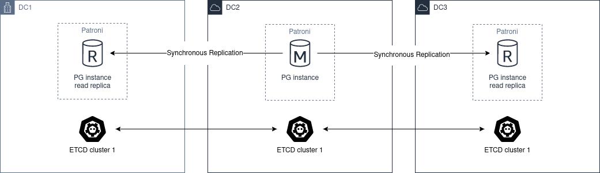
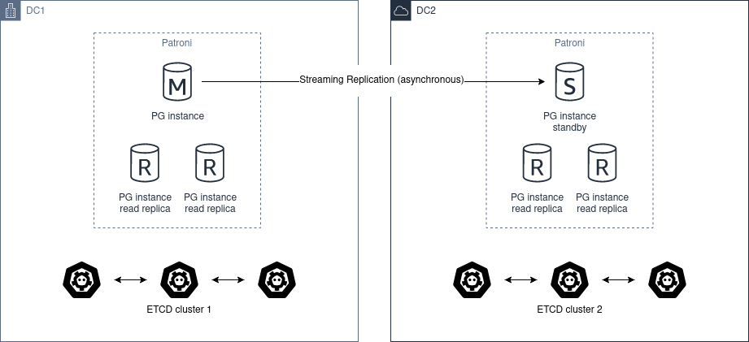

.. _ha_multi_dc:

==========================
HA Across Failure Domains
==========================

The high availability of a PostgreSQL cluster deployed in multiple data centers is based on replication, which can be synchronous or asynchronous (see :ref:`replication modes <replication_modes>`).

In both cases, it is important to be clear about the following concepts:

- Postgres can run as primary or standby leader only when it owns the leading key and can update the leading key.
- You should run the odd number of etcd, ZooKeeper or Consul nodes: 3 or 5!

Synchronous Replication
-----------------------

To have a multi DC cluster that can automatically tolerate a zone drop, a minimum of 3 is required.

The architecture diagram would be the following:

We must deploy a cluster of etcd, ZooKeeper or Consul through the different DC, with a minimum of 3 nodes, one in each zone.

Regarding postgres, we must deploy at least 2 nodes, in different DC. Then you have to set ``synchronous_mode: true`` in the global :ref:`dynamic configuration <dynamic_configuration>`.

This enables sync replication and the primary node will choose one of the nodes as synchronous.

In a multi-DC setup where each Patroni node has a site defined via the :ref:`local configuration <yaml_configuration>` or as the ``PATRONI_SITE`` :ref:`environment variable <environment>`, the dynamic-configuration option ``synchronous_cross_site`` controls *which* replicas are eligible to become synchronous.

See :ref:`cross site synchronous mode <site_awareness_synchronous>` for the full list of modes and the replica-selection pipeline.

.. _site_awareness:

Site awareness
---------------

An optional ``site`` attribute can be assigned to every member to express the physical location it runs in (a data center, an availability zone, a region, or any other grouping that matters operationally). Once configured, the ``site`` value influences how Patroni handles bootstrap, automatic and manual failover, manual switchover, and synchronous replica selection.

Sites are not hierarchical: a node belongs to *one* site at a time, and the same string is shared across nodes that should be considered local to one another.

Configuring the ``site`` attribute
^^^^^^^^^^^^^^^^^^^^^^^^^^^^^^^^^^

The ``site`` value is a non-empty string configured per node. It can be supplied either as the ``site`` key in the local :ref:`YAML configuration <yaml_configuration>` or as the ``PATRONI_SITE`` :ref:`environment variable <environment>`:

.. code:: YAML

    name: postgresql0
    namespace: default
    site: dc1

Where site awareness is used
^^^^^^^^^^^^^^^^^^^^^^^^^^^^^

The same ``site`` attribute influences several subsystems:

- Which replica a fresh member uses as its :ref:`clone source <site_awareness_bootstrap>` during bootstrap or reinit.
- Whether :ref:`automatic failover <site_awareness_failover>` promotes locally or to another site.
- Where :ref:`manual switchover <site_awareness_switchover>` prefers to move the primary.
- Which replicas are eligible to :ref:`become synchronous standbys <site_awareness_synchronous>`.

.. _site_awareness_bootstrap:

Bootstrap and reinit
^^^^^^^^^^^^^^^^^^^^

When a replica needs to bootstrap — either during initial cluster bring-up or when ``patronictl reinit`` is invoked — Patroni picks the source of the ``pg_basebackup`` (or a custom bootstrap method). The selection logic prefers a member in the *same* site as the bootstrapping node:

1. Among members that are running and carry the ``clonefrom`` tag, Patroni first considers those whose ``site`` equals the local node's ``site``. If at least one local clone source is available, the choice is restricted to the local set.
2. If no local clone source is available but the cluster's leader lives in the same site as the bootstrapping node, Patroni uses that leader as the clone source instead of falling back to a remote replica.
3. Only if neither of the above yields a candidate does Patroni widen the search to the whole cluster (any running ``clonefrom`` member, or finally any leader).

The same logic backs both ``patronictl reinit`` and the automatic bootstrap path executed by a fresh member.

See :ref:`replica_imaging_and_bootstrap` for the surrounding bootstrap workflow.

.. _site_awareness_failover:

Automatic failover
^^^^^^^^^^^^^^^^^^

When a replica decides whether it should run the leader race, the local node compares its own ``site`` against the site of the last known leader (the ``current_site`` field of the ``/status`` key):

- If healthy members exist in the current leader's site, a replica in another site declines to race; the failover should land in the site that already hosts the primary.
- Otherwise, Patroni logs that it is performing a cross-site failover and proceeds with the remaining eligible members.

The site-based filters are applied **after** the standard eligibility checks (WAL position, ``nofailover`` tag, ``maximum_lag_on_failover``, watchdog functionality, etc.) — see :ref:`failover_healthcheck` for the full pipeline.

.. note::

    The ``failover_priority`` tag still controls the priority *within* the remaining candidate set. A replica with higher ``failover_priority`` is preferred when several members of the same site are equally eligible.

.. _site_awareness_switchover:

Manual switchover to a site
^^^^^^^^^^^^^^^^^^^^^^^^^^^

The ``patronictl switchover`` command and the REST ``POST /switchover`` endpoint accept an optional ``site`` field:

.. code:: bash

    # Switch over to any healthy member in dc2
    patronictl switchover --site dc2

    # REST API equivalent
    curl -s http://localhost:8008/switchover -XPOST -d \
        '{"leader":"postgresql0","site":"dc2"}'

Behaviour:

- ``patronictl switchover`` rejects ``--candidate`` together with ``--site`` as mutually exclusive.
- The REST ``POST /switchover`` endpoint silently drops ``site`` whenever ``candidate`` is present in the request body.
- ``patronictl failover`` (and ``POST /failover``) does **not** accept ``--site`` as a stored field. Failover requires an explicit ``candidate`` by name. At the ``patronictl`` interactive prompt, ``--site`` only narrows the displayed candidate list before you pick one.

.. _site_awareness_synchronous:

Cross-site synchronous mode
^^^^^^^^^^^^^^^^^^^^^^^^^^^

When the Patroni cluster spans multiple physical :ref:`sites <yaml_configuration>` (datacenters, regions, or availability zones), the choice of which replicas become synchronous has a direct impact on the latency, durability, and failure domain of committed writes. Patroni's ``synchronous_cross_site`` dynamic configuration option lets you constrain this choice based on the ``site`` attribute published by each member. See :ref:`site_awareness_synchronous` for more information.

The option is only meaningful when ``synchronous_mode`` is enabled (i.e. set to ``on`` or ``quorum``) and at least some members publish a non-empty ``site`` attribute. Members without a configured site are treated specially: in ``local_only`` and ``remote_only`` modes they are excluded from the synchronous set, while in ``balanced`` mode they are considered only after every site-aware replica has been picked.

If the *primary itself* has no ``site`` attribute configured, the cross-site logic is bypassed entirely and the selection falls back to the plain ``any`` ordering regardless of the configured mode.

Available modes
~~~~~~~~~~~~~~~

- ``any`` (default): no site-based filtering is applied. Eligible replicas from any site may be picked. This is the historical behaviour and is recommended only when the network topology of the cluster is sufficiently homogeneous that no site is privileged over the others.

- ``local_only``: only replicas from the same site as the primary are considered. This minimises commit latency by guaranteeing that the synchronous acknowledgement stays within the local site. If no local replicas are available, ``synchronous_standby_names`` is set to an empty value, which effectively means the primary will temporarily fall back to asynchronous replication. When ``synchronous_mode_strict`` is enabled, Patroni clears the ``/sync`` DCS key and sets ``synchronous_standby_names`` to the ``__patroni_strict_sync_replica_placeholder__`` sentinel, blocking all writes until a local replica becomes available again.

- ``remote_only``: only replicas from sites other than the primary's site are considered. This ensures that each commit is durably acknowledged by a replica in a different failure domain, at the cost of higher write latency. The behaviour when no remote replica is available mirrors ``local_only``: ``synchronous_standby_names`` becomes empty (or the strict-mode placeholder with ``synchronous_mode_strict``).

- ``prefer_local``: local replicas are preferred, but if there are not enough healthy local replicas to satisfy ``synchronous_node_count``, the remaining slots are filled with the highest-priority remote replicas. Useful when you want to minimise latency under normal conditions but still guarantee that ``synchronous_node_count`` synchronous standbys are available even after a local failure.

- ``prefer_remote``: the mirror of ``prefer_local`` — remote replicas are preferred, but local replicas are used to fill any shortage. This is the right choice when durability is prioritised over latency but you still want to fall back to local replicas during a multi-site outage.

- ``balanced``: replicas are picked round-robin across sites. Patroni builds a per-site list of eligible replicas (sorted deterministically for stability), then interleaves them: one replica from each remote site, then one from the local site, then back to the first remote site, and so on. Replicas without a configured site are added at the end of the list. ``balanced`` is intended for clusters that span three or more sites and want each site to contribute proportionally to the synchronous set.

Interaction with ``synchronous_node_count`` and ``sync_priority``
~~~~~~~~~~~~~~~~~~~~~~~~~~~~~~~~~~~~~~~~~~~~~~~~~~~~~~~~~~~~~~~~~

The replica selection pipeline runs in five strict steps on every HA loop iteration:

1. **Build the eligible set.** Patroni reads ``pg_stat_replication`` on the primary, joins each row with the corresponding member from DCS, and drops cascading replicas, ``nosync`` members, and the primary itself.
2. **Sort by sync_priority.** The eligible set is sorted in descending order by ``sync_priority`` (higher is preferred), then by ``sync_state`` (``sync`` before ``async``), then by the relevant LSN column (``write``, ``flush``, or ``replay`` depending on the ``synchronous_commit`` setting).
3. **Stable sort by nofailover.** A second stable sort puts replicas without ``nofailover`` *before* replicas with it, without disturbing the priority order from step 2.
4. **Apply synchronous_cross_site.** The sorted list is partitioned by site and reordered according to the configured mode. The mode decides **which site contributes replicas first and how many**; the priority order from steps 2–3 is preserved *within each site*.
5. **Apply maximum_lag_on_syncnode.** Patroni walks the reordered list and skips any replica whose LSN lag exceeds the configured threshold.

.. _site_awareness_recipe_site_switchover:

Cross-site manual switchover
^^^^^^^^^^^^^^^^^^^^^^^^^^^^^^

A planned, healthy switchover that moves the primary from ``dc1`` to ``dc2``
without naming an explicit candidate:

.. code:: bash

    patronictl switchover --leader postgresql0 --site dc2

Patroni executes the switchover, and the leader race is restricted to ``dc2`` members once the demote threshold is reached. A replica in ``dc1`` declines to race (see :ref:`site_awareness_failover`).

.. _site_awareness_limitations:

Limitations and caveats
^^^^^^^^^^^^^^^^^^^^^^^

- A node belongs to exactly **one** site at a time. Hierarchies (e.g. region + AZ) must be encoded as a single string.
- ``site`` is a *hint*, not a hard isolation boundary. The ``site`` attribute is read from local configuration and propagated through DCS; a misconfigured node with the wrong ``site`` value will influence failover and synchronous-replica selection as if it really were in that site.
- ``local_only`` / ``remote_only`` combined with ``synchronous_mode_strict`` is the only site-aware mode that **blocks writes** when the chosen site has no eligible replica.

.. _independent_standby_clusters:

Independent standby cluster
----------------------------

A site-aware cluster with a single shared DCS is the preferred design when the sites can participate in one failure-management domain. When the sites must use independent DCS clusters, or when the network between them cannot safely support a single multi-site cluster, use a Patroni :ref:`standby cluster <standby_cluster>` as an alternative. With only two data centers, for example, the standby cluster can run in the second data center and be manually promoted if the first site is down.

The architecture diagram would be the following:

Automatic promotion is not possible because an independent DCS in DC2 cannot determine the state of the cluster in DC1. To switch to DC2 safely, first convert the DC1 cluster into a standby cluster with :ref:`patronictl demote-cluster <patronictl_demote_cluster>`:

.. code:: bash

    $ patronictl -c postgres0.yml demote-cluster batman \
        --host 192.0.2.20 --port 5432 --primary-slot-name batman

If a clean demotion is not possible, use STONITH to fence and stop the source cluster before promoting the target. This prevents the source cluster from remaining writable and creating a split-brain.

Only after the source cluster has been demoted should you promote the healthy target cluster with :ref:`patronictl promote-cluster <patronictl_promote_cluster>`:

.. code:: bash

    $ patronictl -c postgres1.yml promote-cluster batman

.. warning::
    Do not promote the target cluster before demoting the source cluster. Both clusters can otherwise be writable, creating a split-brain.
