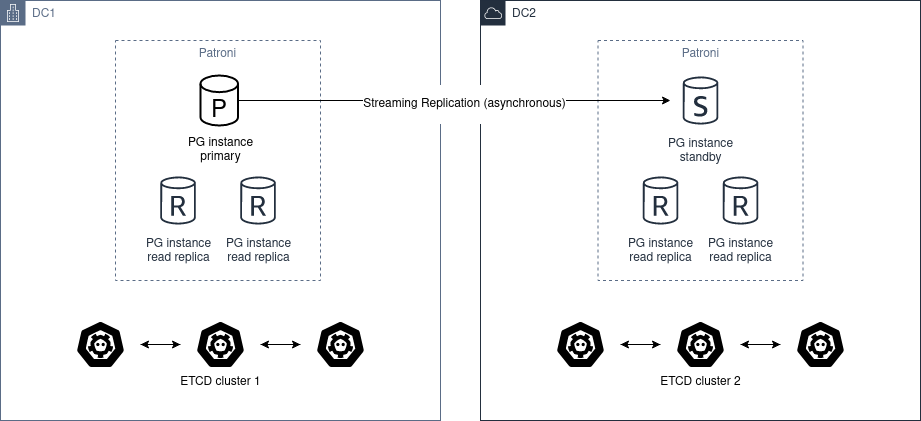

.. _ha_multi_dc:

===================
HA multi datacenter
===================

The high availability of a PostgreSQL cluster deployed in multiple data centers is based on replication, which can be synchronous or asynchronous (`replication_modes <replication_modes.rst>`_).

In both cases, it is important to be clear about the following concepts:

- Postgres can run as primary or standby leader only when it owns the leading key and can update the leading key.
- You should run the odd number of etcd, ZooKeeper or Consul nodes: 3 or 5!

Synchronous Replication
----------------------------

To have a multi DC cluster that can automatically tolerate a zone drop, a minimum of 3 is required.

The architecture diagram would be the following:

.. image:: _static/multi-dc-synchronous-replication.png

We must deploy a cluster of etcd, ZooKeeper or Consul through the different DC, with a minimum of 3 nodes, one in each zone.

Regarding postgres, we must deploy at least 2 nodes, in different DC. Then you have to set ``synchronous_mode: true`` in the global :ref:`dynamic configuration <dynamic_configuration>`.

This enables sync replication and the primary node will choose one of the nodes as synchronous.

Asynchronous Replication
----------------------------------

With only two data centers it would be better to have two independent etcd clusters and run Patroni :ref:`standby cluster <standby_cluster>` in the second data center. If the first site is down, you can MANUALLY promote the ``standby_cluster``.

The architecture diagram would be the following:

Automatic promotion is not possible, because DC2 will never able to figure out the state of DC1.

You should not use ``pg_ctl promote`` in this scenario, you need "manually promote" the healthy cluster by removing ``standby_cluster`` section from the :ref:`dynamic configuration <dynamic_configuration>`.

.. warning::
    If the source cluster is still up and running and you promote the standby cluster you create a split-brain.

In case you want to return to the "initial" state, there are only two ways of resolving it:

- Add the standby_cluster section back and it will trigger pg_rewind, but there are chances that pg_rewind will fail.
- Rebuild the standby cluster from scratch.

Before promoting standby cluster one have to manually ensure that the source cluster is down (STONITH). When DC1 recovers, the cluster has to be converted to a standby cluster.

Before doing that you may manually examine the database and extract all changes that happened between the time when network between DC1 and DC2 has stopped working and the time when you manually stopped the cluster in DC1.

Once extracted, you may also manually apply these changes to the cluster in DC2.
