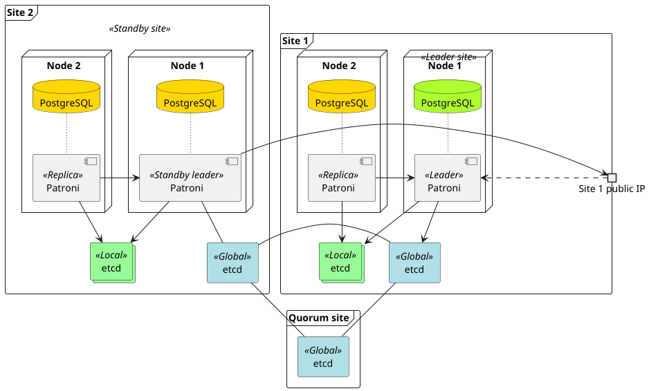

.. _multisite:

Using Patroni in multisite mode
===============================

Introduction
++++++++++++

The multisite mode has been developed to increase resilience of Patroni setups spanning multiple sites against temporary outages.  In multisite mode each site runs a separate Patroni cluster with its own DCS, being able to perform leader switches (switchovers and failovers) as usual Patroni clusters.  On top of this, in multisite mode here is a global DCS for leader site election, which coordinates which site is the primary and which is the standby.  In each site the local leader instance is responsible for global leader site election. The site that acquires the leader lock runs Patroni normally, other sites configure themselves as standby clusters.

When to use multisite mode
--------------------------

If network reliability and bandwidth between sites is good and latency low (<10ms), multisite mode is most likely not useful. Instead, a simple Patroni cluster that spans the two sites will be a simpler and more robust solution.

Multisite mode is useful when automatic cross site failover is needed, but the cross site failover needs to be much more resilient against temporary outages. It is also useful when cluster member IP addresses are not globally routable and cross site communication needs to pass through an externally visible proxy address.

DCS considerations
------------------

There are multiple possible ways of setting up DCS for multisite mode, but in every case there are two separate concerns covered.  One is the local DCS, which is backing the site-local actions of Patroni.  In addition, there is the global DCS, being responsible for keeping track of site state.

Global DCS
~~~~~~~~~~

The multisite deployment will only be as resilient as the global DCS cluster.  DCS has to maintain quorum (more than half of all nodes connected to each other, being able to write the same changes).  In case of a typical 3 node DCS cluster, this means quorum is 2, and if any 2 nodes share a potential failure point (e.g. being attached to the same network component), then that failure will bring the whole multisite cluster into read only mode within the multisite TTL timeout (see Configuration below).

Let's consider an example where there are 2 datacenters, and two of the three DCS nodes are in datacenter A.  If the whole datacenter goes offline (e.g. power outage, fire, network connection to datacenter severed) then the other site in datacenter B will not be able to promote. If that site happened to be leader at the pont of the DCS failure, it will demote itself to avoid a split brain situation, thus retaining safety.

In short, this means that to survive a full site outage the system needs to have at least 3 sites. To simplify things, one of the 3 sites is only required to have a single DCS node. If only 2 sites are available, then hosting this third quorum node on public cloud infrastructure is a viable option.

Here is a typical deployment architecture for using multisite mode:



Cross-site latency
##################

If the network latencies between sites are very high, then DCS might require special tuning. For example, etcd uses a heartbeat interval of 100 ms and election timeout of 1 s by default. If round trip time between sites is more than 100 ms, these values should be increased.

Local DCS
~~~~~~~~~

This is not different from a usual Patroni setup.


Operational how-tos
+++++++++++++++++++

Installation
------------

Linux
~~~~~

Prerequisites
#############

Before starting the installation, Python3 and the matching pip binary have to be installed on the system.

Patroni stores its state and some of its config in a distributed configuration store (DCS).  You have to install one of the possible solutions, e.g. etcd 3.5  (https://etcd.io/docs/v3.5/install/).

Installation steps
##################

As systemd is is now the de-facto init system across Linux distributions, we use it in the below steps.

#. Download and unpack source from ...
#. `cd` to the resulting `patroni` directory
#. `pip install -r requirements.txt`
#. `pip install psycopg`
#. create Patroni config (see ...)
#. to run Patroni as a systemd service, create a systemd unit config based on the linked example: https://github.com/patroni/patroni/blob/master/extras/startup-scripts/patroni.service
#. start Patroni with `[sudo] systemctl start patroni`

Windows
~~~~~~~

You can use Cybertec's packaged versions from https://github.com/cybertec-postgresql/patroni-windows-packaging/releases - go for the versions marked 'multisite'.  Follow the [Setup Guide](https://github.com/cybertec-postgresql/patroni-windows-packaging/blob/master/doc/setup.md).

If you need, for example, a different PostgreSQL version from what's provided, open a Github issue there, and a new release will soon be prepared.


Configuration
-------------

Configuring multisite mode is done using a top level ``multisite`` section in Patroni configuration file.

The configuration is very similar to the usual Patroni config.  In fact, the keys and their respective values under `multisite` obey the same rules as those in a conventional configuration.

An example configuration for two Patroni sites:

```yaml
multisite:
  name: dc1
  namespace: /multisite/
  etcd3: # <DCS>
    hosts:
    # dc1
    - 10.0.1.1:2379
    - 10.0.1.2:2379
    - 10.0.1.3:2379
    # dc2
    - 10.0.2.1:2379
    - 10.0.2.2:2379
    - 10.0.2.3:2379
    # dc 3
    - 10.0.0.1:2379
  host: 10.0.1.1,10.0.1.2,10.0.1.3 # How the leader of the other site(s) can connect to the primary on this site
  port: 5432
  # Multisite failover timeouts
  ttl: 90
  retry_timeout: 40
```

Details of the configuration parameters
~~~~~~~~~~~~~~~~~~~~~~~~~~~~~~~~~~~~~~~

`name`
: The name of the site.  All nodes that share the same value are considered to be a part of the same site, thus it must be different for each site.
`namespace`
: Optional path within DCS where Patroni stores the multisite state.  If used, it should be different from the namespace used by the base config, but the same on all sites.
`<DCS>` (in the example `etcd3`)
: The DCS implementation in use.  Possible values are `etcd`, `etcd3`, `zookeeper`, `consul`, `exhibitor`, `kubernetes`, or `raft` (the latter is deprecated).
`<DCS>.hosts`
: a list of IP addresses of nodes forming the global DCS cluster, including the extra (tiebreaking) node(s)
`host`
: Comma-separated list of IPs of the Patroni nodes that can become a primary on the present site
`port`
: Postgres port, through which other sites' members can connect to this site.  It can be specified once if all nodes use the same port, or as a comma-separated list matching the different port numbers, in the order used in the `host` key.
`ttl`
: Time to live of site leader lock. If the site is unable to elect a functioning leader within this timeout, a different site can take over the leader role.  Must be a few times longer than the usual `ttl` value in order to prevent unnecessary site failovers.
`retry_timeout`
: How long the global etcd cluster can be inaccessible before the cluster is demoted. Must be a few times longer than the usual `retry_timeout` value in order to prevent unnecessary site failovers.

Passwords in the YAML configuration
~~~~~~~~~~~~~~~~~~~~~~~~~~~~~~~~~~~

As all standby sites replicate from the leader, users and their passwords are the same on each Postgres node.  Therefore the YAML configuration should specify the same password for each user under `postgresql.authentication`.


Site failover
-------------

In case the multisite leader lock is not updated for at least the time specified by multisite TTL, the standby leader(s) of the other site(s) will try to update the lock.  If successful, the standby leader will be promoted to a proper leader.  As a result, the Postgres primary instance will be now found in a new site.

Restoring the old leader site after site failover
~~~~~~~~~~~~~~~~~~~~~~~~~~~~~~~~~~~~~~~~~~~~~~~~~

Once the problems leading to the site failover are resolved, the old leader site will be able to join the multisite cluster as a standby leader.  There is no automatic attempt made for restoring the original order - that is, if desired, switching back to the old leader site must be done manually, via a site switchover.

Connections to the primary
~~~~~~~~~~~~~~~~~~~~~~~~~~

Applications should be ready to try to connect to the new primary.  See 'Connecting to a multisite cluster' for more details.


Site switchover
---------------

When circumstances arise that makes it necessary to switch the location of the Postgres primary from one site to another, one could do it by performing a site switchover.  Just like a normal switchover, a site switchover can be initiated using `patronictl` (or, alternatively, and API call to the Rest API).  The CTL command is as simple as

```
patronictl multisite-switchover
```

The API call could look like the following (replace 'dc2' with the desired site name):

```
curl --data-binary '{ "target_site": "dc2"}' http://127.0.0.1:8008/multisite_switchover
```

Once the site switchover is done, the old leader site will become a standby site automatically.

Connections to the primary
~~~~~~~~~~~~~~~~~~~~~~~~~~

Applications should be ready to try to connect to the new primary.  See 'Connecting to a multisite cluster' for more details.


Glossary
++++++++

DCS
: distributed configuration store
site
: a Patroni cluster with any number of nodes, and the respective DCS - usually corresponding to a data centre
primary
: the writable PostgreSQL node, from which the other nodes replicate their data (either directly or in a cascading fashion)
leader
: the node which other nodes inside the same site replicate from - the leader can be a replica itself, in which case it's called a _standby leader_
site switchover
: a (manual) leader site switch performed when both sites are functioning fine
site failover
: when the main site goes down (meaning there is no Patroni leader and none of the remaining nodes (if any left) can become a leader), the standby leader will be promoted, becoming a leader proper, and the Postgres instance running there becoming the primary
leader site
: the site where the PostgreSQL primary instance is
standby site
: a site replicating from the leader site, and a potential target for site switchover/failover
DCS quorum
: more than half of the DCS nodes are available (and can take part in a leader race)
multisite leader lock
: just like under normal Patroni operation, the leader puts/updates an entry in DCS, thus notifying other sites that there is a functioning Postgres primary running.  The entry mentioned is the multisite leader lock.